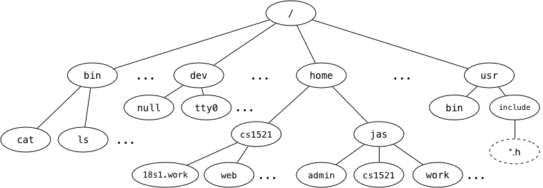

# Week 8 Tute


### 1. We say that the Unix filesystem is tree-structured, with the directory called / as the root of the tree, e.g.,



### Answer the following based on the above diagram:

### a) What is the full pathname of COMP1521's `web` directory?
/home/cs1521/web

### b) Which directory is `~jas/../..`?
/

### c) Links to the children of a given directory are stored as entries in the directory structure. Where is the link to the parent directory stored?
..

### d) What kind of filesystem object is `cat`?
`cat` is a regular file

### e) What kind of filesystem object is `home`?
`home` is a directory

### f) What kind of filesystem object is `tty0`?
`tty0` is a special file, it's a device

### g) What kind of filesystem object is a symbolic link? What value does it contain?
A symbolic link contains the name of a file

### h) Symbolic links change the filesystem from a tree structure to a graph structure. How do they do this?
Symbolic links can link arbitrary files in the filesystem together

___
### 3. What does `fopen` do? What are its parameters?
`fopen` opens a file. It takes a filename and a string representing what mode to open it in.

Some of the modes are:
- `r`: open for reading
- `w`: open for writing (but deletes everything that was there)
- `a`: open for writing add to the end of the file

Check out [`man fopen`](https://man7.org/linux/man-pages/man3/fopen.3.html) for more details about the modes

___
### 4. What are some circumstances when `fopen` returns NULL?
Some reasons that `fopen` might return NULL include
- File you tried to open for reading does not exist
- Trying to open a read only file for writing
- Path name was too long
- Mode string was invalid

Check out [`man fopen`](https://man7.org/linux/man-pages/man3/fopen.3.html) and [`man 2 open`](https://man7.org/linux/man-pages/man2/open.2.html) for examples in the `ERRORS` section

___
### 5. How do you print the specific reason that caused `fopen` to return `NULL`?
Given an error number, `strerror` will return the corresponding string.

You can use `perror` to print a string to `stderr` with the string corresponding to the `errno` set.


Note: `perror` and `fprintf(stderr, ...)` can both be used to print to standard error.
However, the differences are that `perror` will append `: <reason for failure>` at the end of the string you have passed in.

This means, if you did not call a function that failed and caused `errno` to be set and use `perror`, you will end up with a `: Success` after the string you've passed in.

___
### 6. Write a C program, `first_line.c`, which is given one command-line argument, the name of a file, and which prints the first line of that file to stdout. If given an incorrect number of arguments, or if there was an error opening the file, it should print a suitable error message.
``` C
#include <stdio.h>

#define MAX_SIZE 1000

int main(int argc, char *argv[]) {
    if (argc != 2) {
        fprintf(stderr, "Usage: %s <filename>\n", argv[0]);
        return 1;
    }

    FILE *stream = fopen(argv[1], "r");
    if (stream == NULL) {
        perror(argv[1]);
        return 1;
    }

    char line[MAX_SIZE];
    fgets(line, MAX_SIZE, stream);
    printf("%s", line);

    fclose(stream);
    return 0;
}
```

___
### 7. Write a C program, `write_line.c`, which is given one command-line argument, the name of a file, and which reads a line from `stdin`, and writes it to the specified file; if the file exists, it should be overwritten.
``` C
#include <stdio.h>

#define MAX_SIZE 1000

int main(int argc, char *argv[]) {
    if (argc != 2) {
        fprintf(stderr, "Usage: %s <filename>\n", argv[0]);
        return 1;
    }

    FILE *stream = fopen(argv[1], "w");
    if (stream == NULL) {
        perror(argv[1]);
        return 1;
    }

    char line[MAX_SIZE];
    fgets(line, MAX_SIZE, stdin);
    fprintf(stream, "%s", line);

    fclose(stream);
    return 0;
}
```

___
### 8. Write a C program, `append_line.c`, which is given one command-line argument, the name of a file, and which reads a line from `stdin` and appends it to the specified file.
``` C
#include <stdio.h>

#define MAX_SIZE 1000

int main(int argc, char *argv[]) {
    if (argc != 2) {
        fprintf(stderr, "Usage: %s <filename>\n", argv[0]);
        return 1;
    }

    FILE *stream = fopen(argv[1], "a");
    if (stream == NULL) {
        perror(argv[1]);
        return 1;
    }

    char line[MAX_SIZE];
    fgets(line, MAX_SIZE, stdin);
    fprintf(stream, "%s", line);

    fclose(stream);
    return 0;
}
```

___
### 9. Why should you not use `fgets` or `fputs` with binary data?
`fgets` and `fputs` will read or write until it reaches a null terminator `'\0'`. Since null terminators are 0, and binary data often contains 0, you may often not read or write enough characters.

___
### 11. How many different values can `fgetc` return?
257 (0-255 for a char as well as EOF which is usually -1)

___
### 12. Why are the names of `fgetc`, `fputc`, `getc`, `putc`, `putchar`, and `getchar` misleading?
Because they can be used for reading or writing bytes not just characters.

___
### 13. For each of the following calls to the `fopen()` library function, give an `open()` system call that has equivalent semantics relative to the state of the file.
### Obviously, `fopen()` returns a `FILE*`, and `open()` returns an integer file descriptor. Ignore this for the purposes of the question; focus on the state of the open file.

### a)
``` C
fopen(FilePath, "r")
```
"r" means we want to read and it should fail if the file does not exist, so
``` C
open(FilePath, O_RDONLY);
```


### b)
``` C
fopen(FilePath, "a")
```
"a" means we want to write to a file, if the file does not exist, we should create it, and if it does, we want to write to the end of it, so
``` C
open(FilePath, O_WRONLY | O_CREAT | O_APPEND)
```


### c)
``` C
fopen(FilePath, "w")
```
"w" means we want to write to a file, if the file does not exist, we should create it, and if it does, we want truncate it and write from the beginning, so
``` C
open(FilePath, O_WRONLY | O_CREAT | O_TRUNC)
```


### d)
``` C
fopen(FilePath, "r+")
``` C
"r+" means we want to read from and write to a file, if the file does not exist, it should fail, so
```
open(FilePath, O_RDWR | O_TRUNC)
```

### e)
``` C
fopen(FilePath, "w+")
```
"w+" means we want to read from and write to a file, if the file does not exist, we should create it, and if it does, we want to write to the end of it, so
``` C
open(FilePath, O_RDWR | O_TRUNC | O_CREAT)
```

___
### 14. Consider the `lseek(fd, offset, whence)` function.
### a) What is its purpose?
`lseek` moves the file position for an open file descriptor.

`whence` can be either `SEEK_SET` meaning the start of the file, `SEEK_CURR` meaning the current position of the file and `SEEK_END` meaning the end of the file.

`offset` is how far from `whence` the position should be moved.


### b) When would it be useful?
`lseek` is useful when you need to read from or write to a known position in the file

### c) What does its return value represent?
The return value will be -1 if it fails or the current position of the file

___
### 15. Consider a file of size 10000 bytes, open for reading on file descriptor fd, initially positioned at the start of the file (offset 0). What will be the file position after each of these calls to lseek()? Assume that they are executed in sequence, and one will change the file state that the next one deals with.
| part | function call | return value | offset |
|:---:|:---:|:---:|:---:|
| a | `lseek(fd, 0, SEEK_END);` | 10000 | 10000 |
| b | `lseek(fd, -1000, SEEK_CUR);` | 9000 | 9000 |
| c | `lseek(fd, 0, SEEK_SET);` | 0 | 0 |
| d | `lseek(fd, -100, SEEK_SET);` | -1 | 0 |
| e | `lseek(fd, 1000, SEEK_SET);` | 1000 | 1000 |
| f | `lseek(fd, 1000, SEEK_CUR);` | 2000 | 2000 |


___
### 16. If a file `xyz` contains 2500 bytes, and it is scanned using the following code:
``` C
int fd;         // open file descriptor
int nb;         // # bytes read
int ns = 0;     // # spaces
char buf[BUFSIZ]; // input buffer

fd = open ("xyz", O_RDONLY);
assert (fd >= 0);
while ((nb = read (fd, buf, 1000)) > 0) {
    for (int i = 0; i < nb; i++)
        if (isspace (buf[i]))
            ns++;
}
close (fd);
```

### Assume that all of the relevant `#include`'s are done.
### How many calls with be made to the `read()` function, and what is the value of nb after each call?

| call number | nb | file position |
|:---:|:---:|:---:|
| 1 | 1000 | 1000 |
| 2 | 1000 | 2000 |
| 3 | 500 | 2500 |
| 4 | 0 | 2500 |
